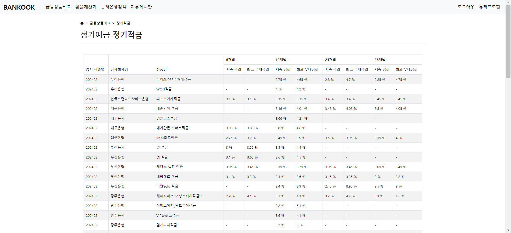
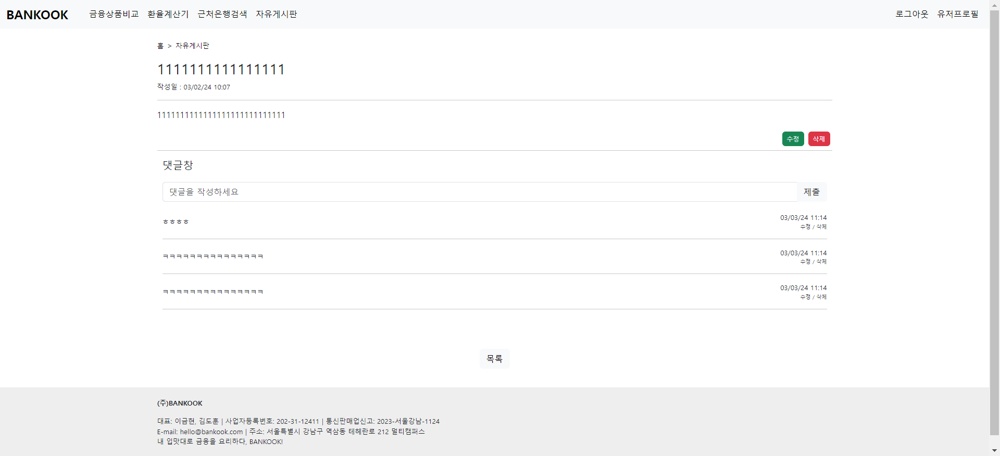

# 내 입맛대로 금융을 요리하다, BANKOOK

## 목차
1. [GOAL](#-goal)
2. [TECH STACK](#-tech-stack)
3. [API](#-api)
4. [Prototype](#-prototype-kakao-oven)
5. [ERD](#-erd-django-extentions-graph_models)
6. [역할분담](#-역할분담-기능으로-분담)
7. [서비스 화면](#-서비스-화면 )

 

---

 

## 📌 GOAL
- 금융상품 추천 서비스를 포함한 금융 상품 비교 웹 애플리케이션 구현

 

## 💻 TECH STACK
- front: JavaScript, Vue, Node.js
- back: Django, SQLite

 

## 📚 API
* Kakao Maps API
* 한국수출입은행 환율 API
* 금융감독원 API
* 대한민국 법정동 코드 조회 API (juso.dev)

 

## 🎨 Prototype (Kakao Oven)

 

## ⚙ ERD (django-extentions graph_models)
* django-extentions 라이브러리의 graph_models 패키지를 이용
* accounts 모델은 django.contrib.auth.models로부터 AbstractUser model을 import 받아서 커스텀

 

## 👫 역할분담 (기능으로 분담)
* 이금현: 메인페이지, 근처은행검색, 자유게시판CRUD, CSS 및 UI/UX Design
* 김도훈: 회원커스터마이징, 금융상품비교, 환율계산기, 로그인 기능, 프로필페이지

 

## 🎙 서비스 화면
* 메인페이지
  <table>
    <tr>
      <td>
        
      </td>
    </tr>
  </table>

* 금융상품비교
  <table>
    <tr>
      <td>
        
      </td>
      <td>
        
      </td>
    </tr>
    <tr>
      <td>
        
      </td>
      <td>
        
      </td>
    </tr>
  </table>

* 환율계산기
  <table>
    <tr>
      <td>
        
      </td>
    </tr>
  </table>

* 근처은행검색
  <table>
    <tr>
      <td>
        
      </td>
    </tr>
  </table>

* 자유게시판
  <table>
    <tr>
      <td>
        
      </td>
      <td>
        
      </td>
    </tr>
    <tr>
      <td>
        
      </td>
      <td>
        
      </td>
    </tr>
  </table>

* 회원 정보 관련
  <table>
    <tr>
      <td>
        
      </td>
    </tr>
    <tr>
      <td>
        
      </td>
    </tr>
    <tr>
      <td>
        
      </td>
    </tr>
  </table>
